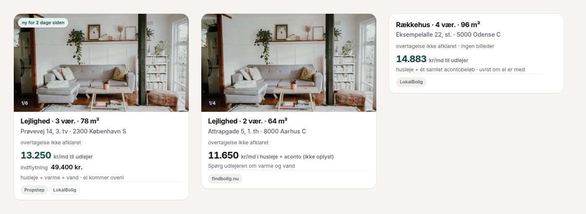
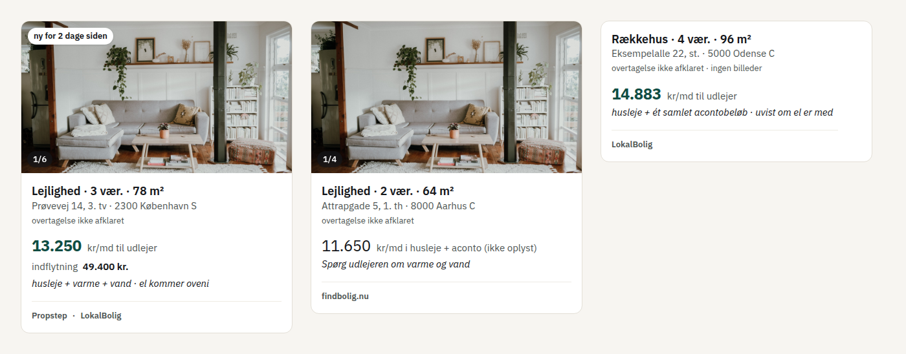
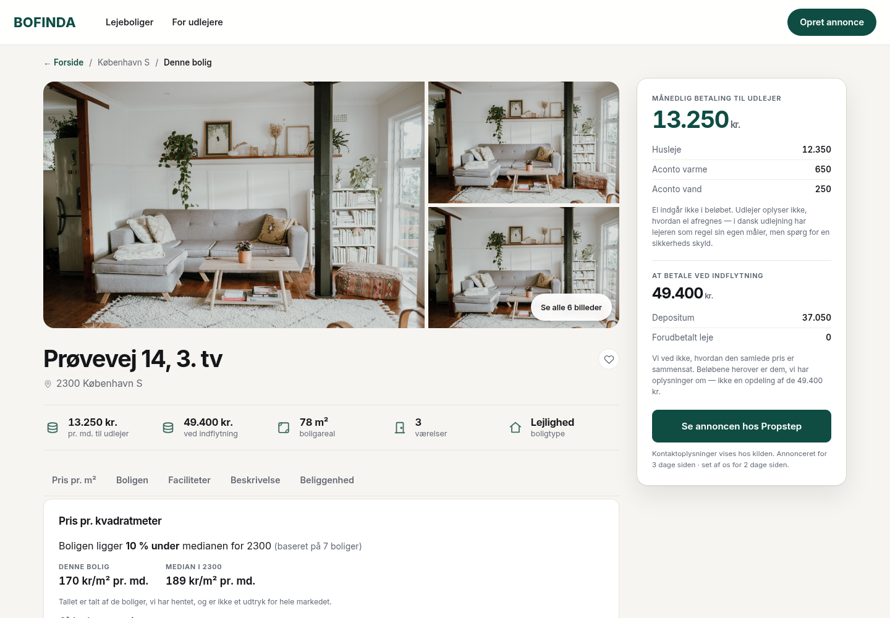
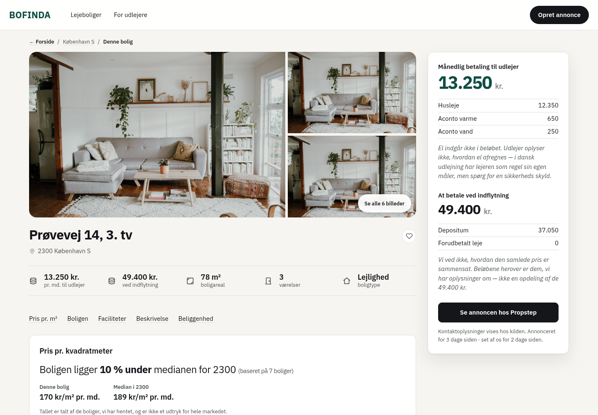
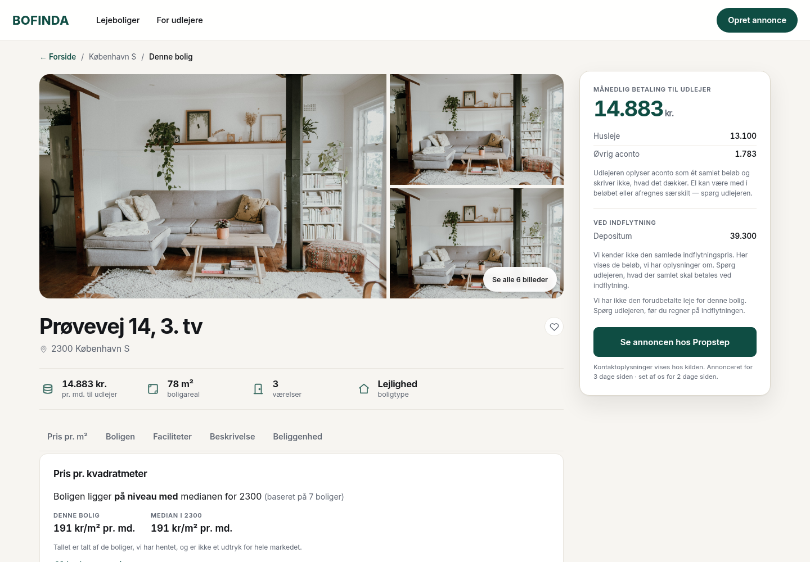
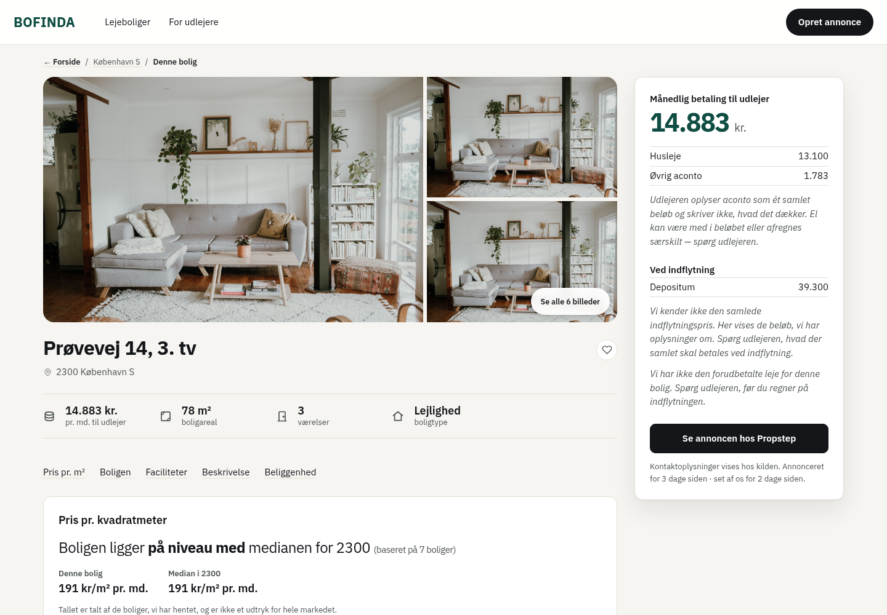
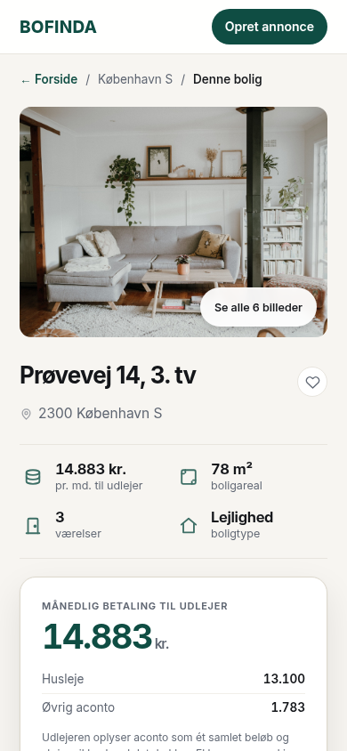
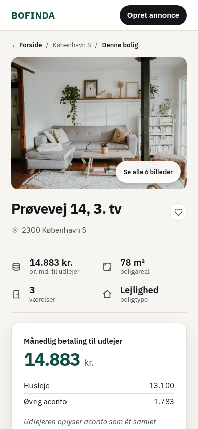
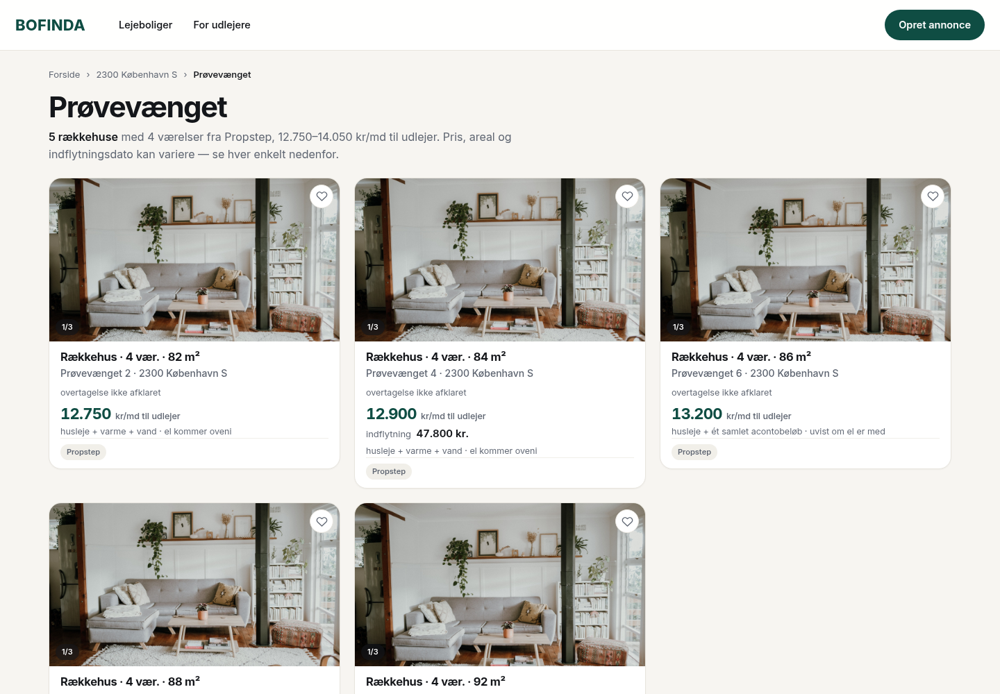
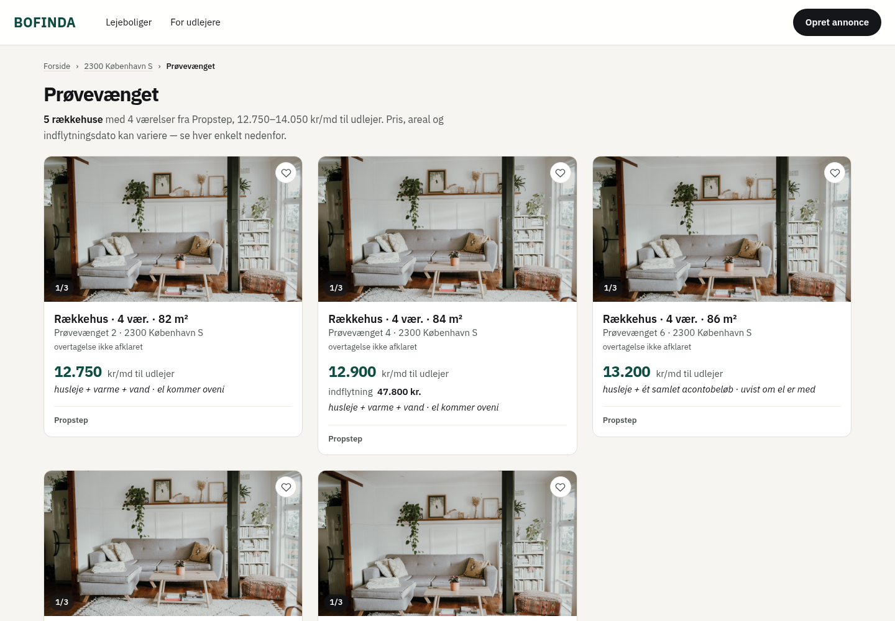

# Designforslag: tallene bærer

26. september 2026. Et forslag, ikke en ændring. `app/globals.css` og
`app/Boligkort.tsx` er ikke rørt: frontend arbejder på kort-hierarkiet på
`opgave/kontakt-ui`, og forslaget skal lægges ind oven på deres skiver.

Retningen var givet: nøgtern og saglig. Produktets eneste påstand er, at
vi siger sandheden om prisen, så udtrykket skal lade tallene bære. Det
skal være behersket uden at være koldt, og valgene skal kunne ses.
Forbeholdene skal læses som troværdighed.

**Forslaget i tre linjer**

| | Beslutning | Værdier |
|---|---|---|
| Typografi | Én skrift: IBM Plex Sans. Seks trin i stedet for 38. | 13 · 15 · 18 · 24 · 32 · 42 px. Vægt 400/600/700. |
| Farve | Teal betyder én ting: *hele betalingen til udlejer er kendt*. En handling er blæk, og resten er gråt. | `--kendt #0f4d43` · `--blaek #14161a` · `--daempet #4d5452` (7,1:1) |
| Rytme | 4 px-gitter. Små trin inde i en gruppe og store mellem grupperne. | 4 · 8 · 12 · 16 · 24 · 32 · 48 · 64 px |

Hele forslaget ligger som CSS i [`forslag.css`](forslag.css). Filen er et
lag, der lægges oven på `globals.css` fra kontakt-ui. Den peger tokens om
og sætter værdier på de selektorer, der findes i dag. Den kræver ingen
ændring i markuppen.

---

## Før og efter

Billederne er de rigtige komponenter fra `origin/opgave/kontakt-ui`
(fdb61f5), gengivet med grenens egen `globals.css`. «Efter» er det samme
med `forslag.css` ovenpå. Markup, data og billeder er ens i de to sæt. Se
[Metode](#metode) nedenfor.

### Kortet

Der er tre tilstande. Kendt total udspecificeret, kun husleje og ét
samlet acontobeløb.




- **Prisen er det eneste fede tal.** Den står i 24/700 teal, og
  kortets titel er 18/600. Før var der 22/720 mod 16,5/690, og syv
  størrelser mellem 11 og 16,5 px.
- **Kun husleje står i 24/400 blæk.** Et delbeløb står ikke fedt. Det
  giver en anden bærer end farven. Før skilte kun kuløren de to ad,
  1,87:1 i lyshed, og med deuteranopi så den grønne total *lysere* ud
  end den sorte husleje.
- **Forbeholdet står i læsestørrelse og kursiv, 15/400 blæk.** Før stod
  det i 12,5 px `--svag`, altså som småt. Kursiv er Bofindas egen stemme
  om data («uvist om el er med», «ikke oplyst»). Romersk er selve dataene.
- **Tre grupper med luft imellem.** Hvad og hvor, hvad det koster, og hvem
  der har den. Målt ned gennem kortet (titel → adresse → meta → pris →
  indflytning → grundlag → fod) er afstandene nu 0 → 4 → **16** → 8 → 4 →
  **16** px. Før var de 3 → 9 → 9 → 6 → 5 → 0: ens for ting der hører
  sammen og ting der ikke gør, og 0 px over fodstregen.
- Kilderne står som tekst i foden, ikke som piller.

### Boligsiden




- **Beløbet vinder over adressen.** Railen er 42/700, og h1 er 32/700.
  Før var begge 38/700 ved 1440 px, så kun farven skilte dem.
- **Railen læses som en deklaration.** Etiketten står i sætningsstil,
  15/600 blæk. Før var den 11 px versaler med sperring, sidens mindste
  tekst over sidens vigtigste tal. Posterne er 15 px med en streg over og
  under, og forbeholdet står i kursiv lige under dem.
- CTA'en er blæk. Teal er forbeholdt beløbet.
- Afsnitsnavigationen ligner ikke længere faner, fordi den aldrig har en
  valgt fane. Den står 16 px over første blok. Før var der 4 px.

Ét samlet acontobeløb, hvor el kan være med i klumpen:




På en telefon. Railens beløb (36 px) er stadig større end h1 (28 px):

| Før | Efter |
|---|---|
|  |  |

### Listesiden

Gruppesiden, som bruger søgeresultatets grammatik: sidetitel, manchet og
kort i gitter.




---

## Undersøgelsen

Tallene er aflæst i `app/globals.css` på main (2784 linjer) og på
kontakt-ui (3592 linjer). Kontrasten er regnet efter WCAG 2.x.

### 1. Hvad er valgt, og hvad er arvet

**Valgt**, med en begrundelse i filen:
- Paletten fra brandarket, med Mørk Teal `#0f4d43` og sandbunden `#f7f5f1`.
- En radius- og en skyggeskala med reglen «jo vigtigere, jo mere løft».
- `tabular-nums` på beløb.
- 44 px som gulv for en handling.
- Forbuddet mod versaletiketter («admin-panelets grammatik»).
- Kolonnetrinene 620/1180 med kort på mindst ca. 380 px.

**Arvet**, uden at nogen har taget stilling:

| | I dag | Bemærkning |
|---|---|---|
| Skrift | Inter via next/font | Den eneste begrundelse i `layout.tsx` handler om selvhosting, ikke om valget. |
| Brødtekst | 15 px / 1,55 | Ingen begrundelse. |
| Skriftstørrelser | **38** | Mellem 11 og 17 px går de i halve pixels, 13 trin på 6 px. |
| Vægte | **20** | 530, 540 og 550 kan ikke skelnes fra hinanden. |
| Linjehøjder / sperringer | 21 / 19 | |
| Afstande | **37** | Hvert heltal fra 1 til 18 px forekommer. |
| `--gab`, `--gab-l`, `--gab-xl` | 0 anvendelser | Defineret «ét sted at rette» og aldrig brugt. |
| `--daempet` / `--svag` | `#5f6672` / `#626975` | **1,05:1** imellem. To navne for én farve, 113 anvendelser. |
| `--bg` / `--sand` | `#f7f5f1` / `#f5f2ed` | 1,03:1. |

På ét boligkort bruges 8 størrelser (11 · 12 · 12,5 · 13 · 14 · 15 · 16,5 · 22)
og 8 vægte. 12,5 px bærer mindst syv roller, blandt andet etiketten ved
prisen, overtagelsesdatoen, en eyebrow og sidefoden.

**Accentens 94 anvendelser** fordeler sig sådan:

| Funktion | Antal |
|---|---|
| Interaktion (fokus 21, hover 14, links 13, knapper 10, native kontroller 4, træk 2) | 64 |
| Tilstand (valgt/aktiv 12, «lykkedes» 4) | 16 |
| Brand og pynt (ordmærke, eyebrow, ikoner, mærkater, gradient, kortmærker) | 11 |
| **Et tal, vi kender** (`.kort-pris`, `.oek-tal`, `.punkter strong`) | **3** |

Filen bruger selv accenten på fire måder: som et målt resultat, som kendt
total over for husleje, som «kan klikkes og fjerner noget» og som «rolig
og grøn som resten». Produktets påstand er med i de 3 %.

Ravgul (`--advarsel`) har 7 betydninger. Blandt dem er aconto ukendt,
venteliste, et *valgt* kortmærke og en fejl i en formular. Filen kalder
det «oplysning, ikke fejl» tre gange, men tokenet hedder advarsel.

### 2. Hvad bærer hierarkiet

**Forsiden.** Hero'en bærer siden med 48/700, 72 px luft og et foto, men
påstanden står ikke i den. Kortprisen er sidens *6. største* tekst (22 px,
under 48, 30, 28 og 25). Den har samme størrelse og farve som talstriben
og ordmærket. De tre h2 er 25, 28 og 30 px, og de *vokser* ned ad siden.
Det mindst vigtige afsnit, udlejerbåndet, har flest virkemidler: den
eneste mørke flade og sidens største h2. Talstriben, som er beviset for
påstanden, står efter 48 kort og 8 px under sidenavigationen. «27 uden»
står i 12,5 px inde i en etiket, mens «236 med» står i 22/700.

**Søgeresultatet og kortet.** Prisen er kortets største tekst, men resten
ligger i syv størrelser mellem 11 og 16,5 px. Økonomiblokken stabler op
til fem slags oplysning i samme 12–12,5 px grå med 4 px imellem:
forbehold, gruppelink, poster og alder. Kortet har ingen grupper, kun
linjer.

**Boligsiden.** Ved 1440 px er h1 og beløbet begge 38/700, så det er
uafgjort. Tre niveauer i prissammenligningen ligger inden for 1 px (h2 17,
dom 16, tal 17). Siden bruger mindst seks forskellige udtryk for «vi ved
det ikke»: 12 px grå, 12,5 px grå, en ravgul boks, 13 px dæmpet, 14 px
svag og en stiplet boks. El-forbeholdet står i samme stil som boilerplate
som «Teksten er skrevet ud fra boligens oplysninger». Det læser som småt,
og øjet lærer at springe 12 px grå over.

**Samlet:** Hierarkiet bæres af størrelse i tre spring (17 → 25 → 38 px på
boligsiden) og af accentfarve. Vægt bærer næsten intet, fordi alt
fremhævet ligger mellem 620 og 760. Luft bærer kun forskellen mellem hero
og resten.

### 3. Hvor bæres betydning af farve alene

36 steder med farvetilstande blev gennemgået, alle 726 regler i
`globals.css` og de betingede klasser i `app/` på main og kontakt-ui.
Hvert fund blev derefter prøvet af to skeptikere, der skulle forsøge at
afvise det. Den ene så på, om teksten ved siden af faktisk bærer
forskellen. Den anden omregnede farverne til gråtone og deuteranopi.
Nedenfor står de fund, som mindst én skeptiker bekræftede, og som ingen
af dem afviste.

Tallet i parentes er lysheden mellem de to tilstande. Under 3:1 kan de
ikke skelnes uden kulør.

| Sted | Tilstande | Andet end farve | Kun farve | Forslaget |
|---|---|---|---|---|
| **Kortets pris** | kendt total / kun husleje (1,87:1) | Etiketten, to ord i 12,5 px grå. **Med deuteranopi ser den kendte total lysere og svagere ud end huslejen**, så vægten vender | delvist · **høj** | 700 mod 400, etiketten i 15 px |
| **Gemte boligers pris** (kontakt-ui, `.gemt-pris`) | kendt total / kun husleje | Etiketten siger «i husleje», mens søgekortet siger «i husleje + aconto (ikke oplyst)». Samme spørgsmål har to udtryk | delvist · middel | Samme to former som kortet. Ordlyden hører til frontend |
| **Valgpillerne i filtervinduet** | valgt / ikke (fladen 1,15:1) | Intet flueben, samme vægt (540), input skjult. Hover giver samme kant som valgt | **ja** · middel | Valgt er blæk-fyld, hover er kun en kant |
| **Favoritknappen, når gemningen fejler** (kontakt-ui) | fejlet / normal | Kun `title`, som kun ses ved hover. Hjertet vender tilbage og ligner et tryk, der ikke blev registreret | **ja** · middel | Kræver synlig tekst eller `aria-live`. Det er markup og hører til frontend |
| **Kvitteringen efter skift af adgangskode** (kontakt-ui) | lykkedes / udlogningen fejlede (striben 1,21:1) | Overskriften er ens i begge. Forskellen står først i andet afsnit | delvist · middel | Kræver sin egen overskrift. Markup |
| **Landkortets valgte mærke** | valgt / ikke (ravgul mod teal, 1,53:1) | `scale(1.18)` | delvist · middel | Vendes om: hvid med blæk-ring. Ravgul betyder «fejl» andre steder |
| **Sorteringsmenuen** | valgt / hover (samme regel) | Opsummeringen «Sortér: Nyeste» over listen og `aria-current`. I den åbne liste er der intet | delvist · lav | Valgt er blæk-fyld, hover er sand |
| **Links midt i tekst** (`.begraensning a`, `.afmeld .note a`, forsøgsnoten) | link / tekst (1,76:1) | Ingen understregning | ja · lav | Understreges |
| **OSM-krediteringens links** | link / tekst (2,56:1, 10,5 px) | Understregning kun ved hover | ja · lav | Understreges. Krediteringen skjules aldrig |
| **Slipfeltet** hos udlejer | fil over feltet / hvile | Teksten skifter ikke. Kantens lyshed skifter | delvist · lav | Kanten bliver optrukket, ikke kun farvet |
| **Kortet, når dets mærke klikkes** | fremhævet / normal | Rulningen, som centrerer kortet. Ringen er 1,06:1 mod bunden | delvist · lav | Ring i blæk |
| **Trinbjælken** hos udlejer | gjort / kommende (1,00:1) | Rækkefølgen. Det aktuelle trin er tydeligt med fyld | delvist · lav | Nu er fyld, gjort er ring, kommende er flad |

**Afvist af begge skeptikere**, altså ikke båret af farve alene:
sidenavigationens aktuelle side (fyld og vægt), railens beløb (etiketten
skifter ord), statusmærkaterne (hvert har sit ord), kildemærkaterne
(fyldet var aldrig tænkt som en betydning), gruppekort mod enkeltkort
(titlen og «fra»), prissammenligningen og talstribens «Ikke opgjort».
Tre af dem er mønstret for resten, fordi de bærer tilstanden i form og ord:
favoritknappens *gemt*-tilstand på kontakt-ui (fyldt hjerte og ramme),
metalinjens statusord og prissammenligningen.

**To steder, hvor problemet ikke er farven, men at der slet ingen bærer
er:**
- **Brødkrummens links** står i `--daempet`, og teksten omkring i
  `--svag`. Det er 1,05:1, samme grå, og der er ingen understregning.
  Forslaget understreger dem.
- **Manglende svar i «Boligen»** (`.fakta2 .mangler`) står i samme grå
  som etiketten ved siden af. Forslaget sætter dem i kursiv blæk.

**Fundet undervejs:** alarmmailen (`lib/alarm.ts:359`, `:479`) bruger
stadig den gamle accent `#14624f` til en kendt pris og til
bekræftelsesknappen. Den skal med, når `--kendt` lander. På Mine annoncer
står «Udgiv igen» i samme røde som «Fjern».

---

## Forslaget

### Typografi: IBM Plex Sans, seks trin

**Én skrift, fordi produktet har én stemme.** Hierarkiet bæres af størrelse
og vægt, ikke af stemmeskift. Kursiv er det ene skift, og det har én
betydning.

**Hvorfor Plex og ikke Inter.** Fem kandidater blev sat i samme railblok
og samme kort (se [`skriftproeve.png`](skriftproeve.png); kursiven er kun hentet til Plex, de andre viser en syntetisk skrå):

| Skrift | «Prøvevej 14, 3. tv · 2300 København S», 15 px | «11.111» / «88.888», 42/700 | Tabelcifre |
|---|---|---|---|
| Inter (i dag) | 267,7 px | 100,8 / 148,6 px | kun med `tnum` |
| **IBM Plex Sans** | **255,0 px** | **139,0 / 139,0 px** | **standard** |
| Source Sans 3 | 230,2 px | 123,5 / 123,5 px | standard |
| Schibsted Grotesk | 259,7 px | 94,2 / 144,5 px | `tnum` gør punktummet ciffer-bredt: «13 . 250» |
| Public Sans | 258,5 px | 101,2 / 151,8 px | kun med `tnum` |

- **Tallene står i kolonne af sig selv.** Plex' cifre er ens brede uden
  `font-variant-numeric`. I dag holdes `tabular-nums` på en håndskrevet
  liste over 7 selektorer (`globals.css:86`), og et nyt beløb uden for
  listen står skævt. Det er CLAUDE.md's fejltype, hvor to udtryk svarer på
  samme spørgsmål, bare i typografi. Med Plex er der intet at glemme.
- **Plex er 5 % smallere end Inter.** Adressen står på én linje i et kort
  på 300 px. Med Inter brækker «København S».
- **Den har karakter uden at være kold.** Plex er en rationel grotesk med
  humanistiske detaljer. Den ser konstrueret ud, ikke tilfældig. Inter er
  standardvalget, og det er det, «arvet typografi» betyder.
- Source Sans 3 har også tabelcifre, men dens lave x-højde gør 13 px svag.
  Schibsted Grotesk falder på punktummet.
- Plex findes på Google Fonts som variabel skrift (100–700, med kursiv) og
  hentes gennem `next/font/google` og selvhostes som i dag. Der kommer
  intet kald til Google fra brugerens browser.

**Skalaen.** Tekstenden bruger små spring, fordi den læses (13 → 15 → 18).
Talenden bruger kvarter, ×4/3 fra 18, fordi den skimmes (24 → 32 → 42).

| Token | px | Linjehøjde | Vægt | Roller | Erstatter i dag |
|---|---|---|---|---|---|
| `--t-1` | 13 | 1,5 | 400 / 600 | meta, fodnote, kilde, mærkat, etiket | 10 · 10,5 · 11 · 11,5 · 12 · 12,5 · 13 |
| `--t-2` | 15 | 1,5 | 400 / 600 | brødtekst, adresse, poster, knap, **forbehold** | 13,5 · 14 · 14,5 · 15 · 15,5 · 16 |
| `--t-3` | 18 | 1,3 | 600 | korttitel, blok-h2, nøgletal | 16,5 · 17 · 18 · 19 |
| `--t-4` | 24 | 1,1 | 700 | **kortets beløb**, sektions-h2, sammenligningens dom | 20 · 22 · 24 · 25 · 26 |
| `--t-5` | 32 (28 ≤560) | 1,1 | 700 | sidens h1, indflytningsbeløbet | 28 · 30 · clamp(26–42) |
| `--t-6` | 42 (36 ≤560) | 1,1 | 700 | **railens beløb**, forsidens hero | 38 · 40 · clamp(30–48) |

- **Vægte:** 400 til tekst, 600 til etiketter og titler, 700 til beløb og
  h1. Tre i stedet for 20.
- **Sperring:** −0,02em fra trin 4 og op, ellers 0. To i stedet for 19.
- **Gulvet er 13 px.** Intet forbehold står under 15 px.
- **Undtagelsen:** Inputfelter på mobil er 16 px, fordi iOS ellers zoomer.
  Den regel står i `globals.css` og bliver.
- **Kursiv er Bofindas stemme om data:** forbehold, «ikke oplyst» og «vi
  ved ikke». Romersk er data. På boligsiden står «Kilden oplyser ikke
  ansøgningsformen» derfor ikke længere i samme grå som etiketten ved
  siden af.

### Farve: teal betyder «kendt»

| Token | Hex | Mod `--bg` | Mod hvid | Betyder |
|---|---|---|---|---|
| `--kendt` | `#0f4d43` | 8,92 | 9,71 | Hele betalingen til udlejer er kendt. Bruges også til ordmærket. |
| `--blaek` | `#14161a` | 16,63 | 18,11 | Tekst **og** handling: knapper, links, fokus, valgt tilstand. |
| `--daempet` | `#4d5452` | 7,13 | 7,76 | Sekundært: etiketter, meta, noter. Erstatter både `--daempet` og `--svag`. |
| `--linje` | `#e3dfd6` | | 1,33 | Streger. |
| `--bg` / `--kort` | `#f7f5f1` / `#fff` | | | Uændrede. |
| `--advarsel` / `--vaek` | uændrede | | | Kun til rigtige advarsler og fejl, fx en formularfejl eller «annoncen er ikke synlig». **Aldrig til et forbehold.** |

- **Hvorfor «kendt» og ikke «handling».** Den grønne pris betyder allerede
  kendt total i koden. `.kort-pris` uden `.kun-leje` er grøn, og CLAUDE.md
  og `npm test` bygger på det. Det er produktets påstand. Forslaget
  fjerner de 91 andre betydninger i stedet for at opfinde en ny. En
  bruger kan skimme et gitter og se, hvilke beløb der er hele beløb.
- **Farve er aldrig den eneste bærer.** Kendt total står i 700, kun
  husleje i 400, og etiketten siger det i ord.
- **Handling er blæk.** Primærknapper er blæk-fyldte med hvid tekst
  (18,1:1). Links understreges, fordi et link i blæk ikke kan skelnes ved
  farve. Valgt er blæk-fyld, og hover er sand, så de to ikke længere er
  identiske.
- **Mekanikken.** `--accent` peges om til `--blaek`, så alle 94
  anvendelser (112 på kontakt-ui) skifter uden at røre en regel. Kun de
  tre steder, hvor accenten betyder «kendt», peges tilbage på `--kendt`:
  `.kort-pris`, `.oek-tal` og `.gemt-pris` på Min side. Det samme gælder
  ordmærket. Omdirigeringen har en bagside: et fjerde «kendt»-sted, som
  ingen har fundet, bliver stille sort. Derfor skal navnene rettes ved
  indlægning (`--accent` → `--handling`) og hvert sted tages stilling
  til.
- **To grå, ikke tre.** `--svag` slås sammen med `--daempet`, som gøres
  mørkere (`#4d5452`, 7,1:1), så 13 px kan læses på sand.
- **Ikoner er grå.** Nøgletallenes ikoner var accent ved .8. De pynter,
  så de betyder ikke noget.

### Rytme: 4 px-gitter

| Token | px | Hvor |
|---|---|---|
| `--l-1` | 4 | inde i en gruppe: titel → adresse → meta, pris → forbehold |
| `--l-2` | 8 | mellem ord og ikoner, stiens led |
| `--l-3` | 12 | kortets fod, noter under poster, knappens polstring |
| `--l-4` | 16 | **mellem kortets grupper**, kortets polstring, navigation → første blok |
| `--l-5` | 24 | mellem blokke, railens polstring, listens gab |
| `--l-6` | 32 | railens to regnskaber (månedligt / indflytning), før afsnitsnavigationen |
| `--l-7` | 48 | mellem sektioner på forsiden |
| `--l-8` | 64 | under sidens sidste sektion |

Otte værdier i stedet for 37. **Luften ligger mellem grupperne, ikke inde i
dem.** Et kort har tre grupper: hvad og hvor, hvad det koster, og hvem der
har den. Railen har to regnskaber. Det, der hører sammen, står tæt, og det,
der ikke gør, står med luft imellem. Streger bruges kun, hvor luften ikke
kan gøre arbejdet. Skyggen er kun på railen, der er sidens vigtigste kort
(«jo vigtigere, jo mere løft»). Kort og blokke er flade.

### Hvad forslaget ændrer ved tidligere beslutninger

Forslaget lægger sig op ad det, der er besluttet før. På tre punkter
ændrer det en beslutning, og det skal ske bevidst:

- **Ravgul skifter betydning.** I dag er den defineret som «en oplysning
  mangler» (`globals.css:1859-1866`), selv om den bruges på 7 måder. I
  forslaget betyder den «noget står i vejen for dig»: en formularfejl, en
  annonce der ikke er synlig, eller et filter der fjerner hele kilder. En
  manglende oplysning står i kursiv i stedet. Begrundelsen er
  kontakt-ui's egen (9c9174e): forbeholdene fordeler sig 46/27/25 %, så
  der er ingen normaltilstand at advare om. Kontakt-ui fjernede den gule
  boks fra kortet, men boligsidens `.oek-mangler` er stadig ravgul, og
  «om de to skal være ens, er ikke afgjort». Forslaget afgør det.
- **Accenten bliver smallere, ikke anderledes.** «Accenten betyder et
  målt resultat» (`globals.css:1436-1442`) og «grøn = kendt total»
  (CLAUDE.md) står begge ved magt. Det, der udgår, er de 91 andre
  anvendelser.
- **Resultatsidens søgefelt** er i dag bevidst 14,5 px, og
  `scripts/cloud/lancering.mjs:319` kræver præcis den værdi. Flyttes
  feltet til skalaens 15 px, skal kontrollen rettes i samme ændring.

Forslaget omgør **ikke** disse beslutninger, som det først så ud til:
- Talstriben bliver på 18 px blæk. Den blev sat ned fra 22 px accent,
  fordi den var «tungere end noget andet på skærmen» (runde-2).
- Hero'en vokser ikke. Den bruger trin 6 (42 px) mod 48 px i dag.
- Der er stadig højst én skillelinje pr. kort (`kortkontrol.mjs`).
- Månedsprisen er stadig større end indflytningsprisen (24 mod 15 px).
- 44 px-gulvet, 16 px i felter på mobil og de ens samtykkeknapper er
  uændrede.

Brandarket nævner fire farver og ingen skrift. Skriftskiftet rører altså
ikke brandet.

### Set på kontakt-ui, uden for forslaget

- **Rækkefølgen i kortets økonomi** modsiger grenens egen commit.
  9c9174e siger tal → grundlag → indflytning, og CSS-kommentaren siger
  «lige under tallet den forklarer». `order` 1/3/6 giver alligevel tal →
  indflytning → grundlag på de 80 % af kortene, der har en
  indflytningspris. Forbeholdet skal stå ved sit tal, hvis det skal
  læses som troværdighed. Det er et hierarkispørgsmål, så det hører til
  frontend.
- `.favoritknap` er 34×34 px, under projektets 44 px-gulv og uden
  begrundelse.
- `.gruppekort .kort-antal` farver billedtælleren teal, og det er det
  eneste, der skiller den fra enkeltkortets. Reglen var død på main,
  men den er levende på grenen.
- CLAUDE.md på grenen citerer stadig mains ordlyd og `Ellinje`, som er
  fjernet.

---

## Sådan lander det

Rækkefølgen, når kontakt-ui er merget:

1. **Skriften.** `app/layout.tsx`: `IBM_Plex_Sans` fra `next/font/google`
   (`weight: 'variable'`, `style: ['normal', 'italic']`,
   `variable: '--font-sans'`). Selvhostes som i dag.
2. **Tokens.** Blokken `:root` fra `forslag.css` erstatter den nuværende i
   `globals.css`. `--gab*` og `--bg-dyb` udgår eller tages i brug.
3. **Reglerne.** Resten af `forslag.css` foldes ind på de selektorer, de
   retter. De står grupperet efter kort, boligside og resten. Ingen af dem
   kræver ny markup.
4. **Omdøbningen.** `--accent` → `--handling`, og det gøres fil for fil.
   Omdirigeringen i trin 2 holder siden rigtig imens.
5. **Kontrol.** `npm test` bruger klasser, ikke farver, så grøn-total-prøven
   er uændret. `kortkontrol.mjs` og `fotokontrol.mjs` måler geometri og
   skal køres igen. Målt i gengivelsen: kortet bliver 31 px højere (421 →
   452 px), fordi luften mellem grupperne vokser, men **det første beløb
   står samme sted** (584 → 585 px fra toppen på listesiden). Railen
   vokser fra 660 til 729 px. Den klæber 78 px fra toppen, så CTA'en lå
   allerede tæt på kanten af en 768 px laptop. Forslaget lader den
   derfor kun klæbe ved en højde på mindst 861 px. 44 px-gulvet er
   uberørt. Før/efter tages om med
   `docs/designforslag/gengivelse/gengiv.sh` (se nedenfor).

**Forslag til frontend, som kræver markup og derfor ikke er med her:**
- **Forbeholdet som en række i regnskabet.** Railen viser kun de poster,
  der kendes, og lægger el-forbeholdet i en note. Faste rækker (husleje ·
  varme · vand · el), hvor en ukendt post står som *ikke oplyst* i
  beløbskolonnen, ville gøre fraværet synligt der, hvor tallet ville have
  stået. Det er CLAUDE.md's «en manglende oplysning skal være synlig, ikke
  fraværende» sat op som tabel.
- **Nøgletalsstrimlen** gentager månedsprisen uden forbehold, og på mobil
  kommer den *før* railen. Den første pris, man læser, er altså den uden
  forbehold. Railen bør eje pengene.
- **«Øvrig aconto»**, når den er den eneste post, antyder, at der er andre.
  Et bedre navn er «Aconto (uspecificeret)».
- **Talstriben** på forsiden står efter 48 kort og 8 px under
  sidenavigationen. Beviset for påstanden bør stå i første skærm med
  begge grupper som tal (236 med / 27 uden).

---

## Metode

Appen blev ikke startet. Billederne er gengivet statisk af de rigtige
komponenter. Kortet er `Kort` fra `app/Boligkort.tsx` med opdigtede
boliger. Boligsiden og gruppesiden er sidekomponenterne selv, kørt mod
PGlite i processen, ligesom `npm test` gør. Der er ingen server, intet
netværk og ingen `.env`. Markuppen sættes ind i layoutets skal med
checkoutens egen `globals.css` og fotograferes med Chromium.

- **Troskab:** «Før»-billederne er sammenlignet med de seneste
  skærmbilleder i `docs/frontend-lancering-v2/designloeft/` og
  `docs/resultatdesign/kort/`. Layout, størrelser og farver stemmer. De
  kendte forskelle er de ændringer, der er kommet siden 14. september.
- **Data:** Boligerne er opdigtede (Prøvevej, Attrapgade, Eksempelalle).
  Fotoet er sidens eget stemningsfoto (`public/hero-stue.jpg`, Taryn
  Elliott / Pexels) med forskudt beskæring. Billedproxyen findes ikke uden
  server.
- **Ikke gengivet:** Forsiden og søgesidens top. De kræver `next/cache`,
  som kun findes i Next-runtime. Reglerne for dem står i `forslag.css`
  under «Uden for billederne», men de er ikke set i en browser.

Sådan tages før/efter om fra en vilkårlig checkout:

```bash
git worktree add --detach /tmp/ku origin/opgave/kontakt-ui
ln -s "$PWD/node_modules" /tmp/ku/node_modules
docs/designforslag/gengivelse/gengiv.sh /tmp/ku /tmp/ud docs/designforslag/forslag.css
```
